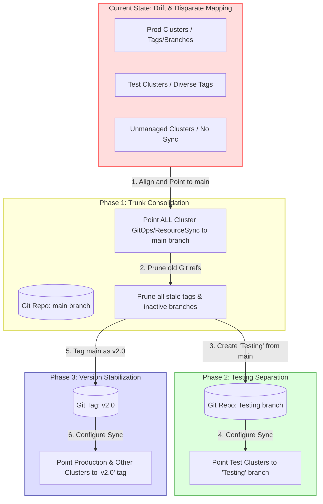

# GitOps Cluster Consolidation & Version Control Roadmap

This roadmap outlines the strategic phased approach for consolidating disparate, tag-drifted, or unmanaged GitOps clusters (environments) back into a fully version-controlled lifecycle managed off of a single `main` branch with tagging.

## Objective
To eliminate repository drift, simplify environment configuration, and establish a clear promotion path by:
1. Baselining all clusters onto a single trunk (`main`) with no active tags or branches.
2. Cleaning up all unused/stale git branches and tags.
3. Separating testing environments onto a dedicated long-lived `Testing` branch.
4. Pinning all remaining environments (production, shared services) to a new, immutable release tag (`v2.0`).

---

## High-Level Flowchart

---

## Phased Consolidation Plan

### Phase 1: Trunk Consolidation (Stabilization Baseline)
**Goal:** Consolidate all GitOps controllers/ResourceSync configurations to point strictly to the `main` branch with zero tag/revision overrides.

1. **Map and Align Configurations:**
   - Update all cluster GitOps configs (e.g., Komodo `[[resource_sync]]` target revisions or ArgoCD target revisions) to use the `main` branch.
   - Ensure all cluster-specific directories (e.g., `komodo/prod/`, `komodo/test/`, `komodo/dev/`) are unified on `main`.
2. **Reconcile and Validate:**
   - Allow GitOps controllers to reconcile. Confirm that all clusters are running stable configurations served purely from `main`.
3. **Repository Pruning:**
   - Delete all unused, stale, and tracking branches.
   - Purge old tags from the remote git origin to prevent metadata clutter and reference confusion.

### Phase 2: Testing Isolation
**Goal:** Branch out the testing clusters to a dedicated, long-lived branch to isolate validation work from main production configurations.

1. **Branch Creation:**
   - Branch `Testing` directly from the cleaned and verified `main` branch.
2. **Target Re-pointing:**
   - Modify the GitOps sync configurations of your **Test Clusters** to track the `Testing` branch instead of `main`.
3. **Promotion Workflow Baseline:**
   - Features/workloads are committed to `main` (or individual feature branches), validated, merged to `main`, and then merged from `main` to `Testing` for soak tests.

### Phase 3: Release Pinning (`v2.0` Tag)
**Goal:** Establish release stability by pinning production and all non-test clusters to an immutable point-in-time release.

1. **Tag Generation:**
   - Tag the stable `main` branch with the new version tag: `v2.0`.
2. **Target Re-pointing:**
   - Update the GitOps sync configurations for all remaining clusters (e.g., Production, Shared Core Services) to target `refs/tags/v2.0`.
3. **Establish Lifecycle Operations:**
   - All subsequent production updates are promoted from `Testing` back to `main`, and then promoted to production by updating/moving the target tag (e.g., `v2.1`, `v2.2`) or updating the tag pointer.

---

## Key Benefits
* **Clean Git Slate:** Drastically reduces active git refs, making branch history easy to read and manage.
* **Predictable Promotion:** Features move from `main` $\rightarrow$ `Testing` branch $\rightarrow$ `v2.0` tag.
* **Auditability:** Clear division of what is being tested versus what is running in production based purely on git references.
