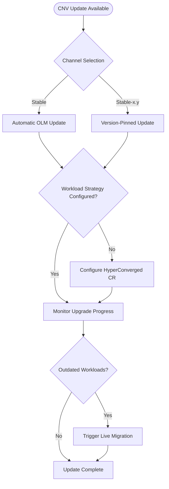

# OpenShift Virtualization (CNV) Update Strategy

Configure and monitor OpenShift Virtualization operator upgrades with automatic VM workload updates.

## Overview

OpenShift Virtualization updates are managed by the Operator Lifecycle Manager (OLM) and follow a different process than OpenShift cluster upgrades. This section covers:

- CNV version compatibility and channel selection
- Configuring automatic VM workload updates during CNV upgrades
- Monitoring upgrade progress and detecting issues
- Special handling for control-plane-only updates (OpenShift 4.16+)

## Key Difference: CNV Update vs OpenShift Cluster Upgrade

| Aspect | OpenShift Cluster Upgrade | CNV Update |
|--------|---------------------------|-------------|
| **Trigger** | Cluster Version Operator | Operator Lifecycle Manager (OLM) |
| **Orchestration** | Manual/AAP/ACM-driven | OLM automatic |
| **VM handling** | Manual live migration planning | Automatic (if configured) |
| **Primary focus** | Node drain + migration sequencing | Configuration + monitoring |

## Update Decision Tree



## Process Summary

### Standard CNV Update

1. **Verify prerequisites** — Check CNV version compatibility with OpenShift version
2. **Configure HyperConverged CR** — Set `workloadUpdateStrategy` for automatic VM updates
3. **Monitor upgrade progress** — Watch operator status and VM migrations
4. **Verify completion** — Confirm all VM workloads updated, no outdated `virt-launcher` pods

### Control Plane Only Updates (OpenShift 4.16+)

Special handling required when upgrading OpenShift 4.15 → 4.16 or later:

1. OpenShift control plane upgrades first
2. CNV workload updates are **disabled** during control-plane-only update
3. After control plane upgrade completes, **re-enable** CNV workload updates
4. Wait for all `virt-launcher` pods to update
5. Verify `outdatedVirtualMachineInstanceWorkloads = 0`
6. Proceed to worker node upgrade or next OpenShift version

## Documents in This Section

| Document | Purpose |
|----------|---------|
| [prerequisites.md](prerequisites.md) | Version compatibility, channel selection, pre-update checks |
| [hyperconverged-config.md](hyperconverged-config.md) | Configure `workloadUpdateStrategy` and migration settings |
| [monitoring-upgrade.md](monitoring-upgrade.md) | Monitor upgrade progress, check outdated workloads |
| [control-plane-only.md](control-plane-only.md) | Special handling for OpenShift 4.16+ control-plane updates |

## Artifacts

| Collection | Files | Purpose |
|------------|-------|---------|
| `artifacts/hyperconverged/` | 3 YAML configs | Baseline, aggressive, conservative workload update profiles |
| `artifacts/verification/` | Shell script, Ansible playbook | Check outdated workloads, monitor upgrade progress |

## Integration with Cluster Upgrades

CNV updates typically occur **before** or **after** OpenShift cluster upgrades, not during. The recommended sequence:

```
1. Update CNV to version compatible with current OpenShift
2. Verify all VM workloads updated
3. Plan OpenShift cluster upgrade (see main execution guides)
4. During cluster upgrade: CNV handles VM migrations automatically
5. After cluster upgrade: Update CNV to version for new OpenShift
```

**Exception:** Control-plane-only updates (OpenShift 4.16+) require CNV workload updates to be disabled, then re-enabled after control plane upgrade.

## Related Documents

- **Main execution guides:** `../execution-guides/` — OpenShift cluster upgrade orchestration
- **VM policy thresholds:** `../adr/0001-vm-policy-thresholds.md` — Migration policy definitions
- **Timeout calculation:** `../migration-timeout-calculation.md` — Calibration methodology

## Red Hat Documentation

- [OpenShift Virtualization: Updating OpenShift Virtualization](https://docs.redhat.com/en/documentation/openshift_container_platform/latest/html/virtualization/updating) — Official update documentation
- [Configuring workload update methods](https://docs.openshift.com/container-platform/latest/virt/virtual_machines/virt-node-maintenance-virt.html#virt-configuring-workload-update-methods_virt-node-maintenance-virt) — HyperConverged CR configuration
- [Live migration](https://docs.openshift.com/container-platform/latest/virt/live_migration/virt-about-live-migration.html) — Live migration overview and configuration
- [Operator Lifecycle Manager](https://docs.openshift.com/container-platform/latest/operators/understanding/olm/olm-understanding-olm.html) — OLM concepts and workflow
