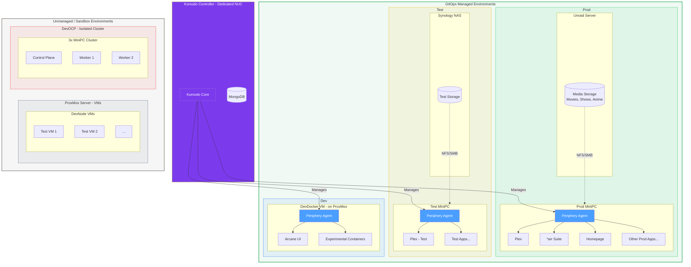
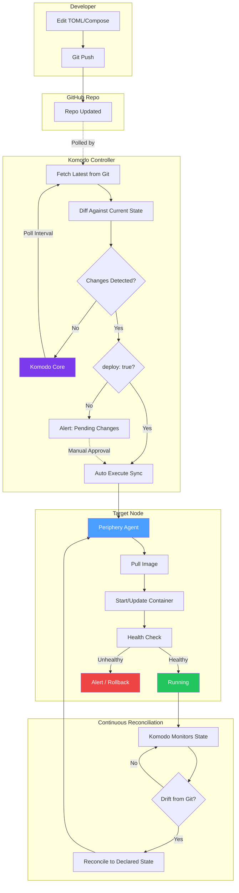

# Architecture

System diagrams and visual documentation for the homelab infrastructure.

---

## Environment Map

High-level view of all environments and their relationships.

### Legend

| Color | Meaning |
|-------|---------|
| Purple | Komodo management plane (Controller) |
| Blue (fill) | Periphery agents |
| Green outer border | GitOps managed environments |
| Green inner | Prod environment |
| Yellow inner | Test environment |
| Blue inner | Dev environment (DevDocker) |
| Gray outer border | Unmanaged / sandbox environments |
| Gray inner | DevNode VMs (ProxMox) |
| Red inner | DevOCP (isolated, work-related) |

### Key Points

- **Komodo Controller** sits outside the environment groups — it manages but is not part of workload infrastructure
- **Managed environments** (Prod, Test, Dev) have Periphery agents and are GitOps-controlled
- **Dev (DevDocker)** runs on ProxMox but is still Komodo-managed — promotion path to Test → Prod
- **Unmanaged environments** are sandboxes — no Periphery agents, no GitOps
- **DevNode** VMs on ProxMox are for ad-hoc testing (bugfixes, themes) — no container management
- **DevOCP** is fully isolated — separate hardware (3x MiniPCs), no Komodo integration
- **Storage** is accessed via network mounts from Unraid (Prod) and Synology (Test)

---

## GitOps Flow

How changes flow from Git to running containers.

### Flow Explanation

1. **Developer** edits TOML or Compose files and pushes to GitHub
2. **Komodo Core** polls GitHub on a configured interval
3. **Diff detection** compares Git state to current deployed state
4. **Deployment decision:**
   - If `deploy: true` in the resource config → auto-deploy
   - If `deploy: false` → alert about pending changes, wait for manual approval
5. **Periphery Agent** on the target node pulls the image and starts/updates the container
6. **Health check** determines success or triggers alerts/rollback
7. **Continuous reconciliation** monitors for drift and corrects it automatically

---

## Hardware Summary

| Component | Role | Environment |
|-----------|------|-------------|
| **NUC** | Komodo Controller | Management plane |
| **MiniPC (Prod)** | Container host | Prod |
| **Unraid Server** | Media storage | Prod |
| **MiniPC (Test)** | Container host | Test |
| **Synology NAS** | Test storage | Test |
| **ProxMox Server** | VM host | Dev, DevNode |
| **3× MiniPC Cluster** | OpenShift | DevOCP |

---

## Network Topology

*To be documented — network segmentation, VLANs, access controls between environments.*
