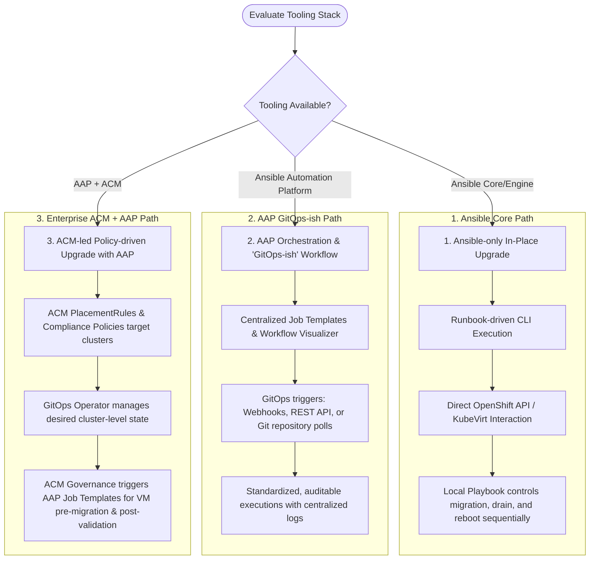

# OpenShift Virtualization VM Migration Strategy

An enterprise strategy to minimize downtime during OpenShift cluster node maintenance by optimizing KubeVirt live migration convergence for large-memory and high-dirty-rate virtual machines.

## Project Objectives

* Define a standard, repeatable operating model to achieve near-zero-downtime cluster upgrades.
* Categorize and segment VM workloads by resource profile (memory size and memory dirty rate) to apply appropriate migration profiles.
* Evaluate and tune native OpenShift Virtualization and KubeVirt controls (auto-converge, post-copy, timeouts, and bandwidth).
* Establish a robust decision tree mapping available infrastructure tooling (Ansible, AAP, ACM) to appropriate orchestration workflows.

---

## Upgrade Orchestration Decision Tree

This decision tree guides operators and architects in choosing the most robust migration and upgrade workflow based on the available tooling in the environment.

---

## Tooling Integration & Architectural Paths

### 1. Ansible Core (Engine-only)
* **Target Audience:** Standard environments or teams lacking centralized orchestration tools.
* **Mechanism:** Playbooks executed from a jump host or administrator terminal.
* **Key Operations:**
  * Uses the `kubernetes.core` Ansible Collection to authenticate to the OpenShift API.
  * Explicitly triggers VM live migrations by creating KubeVirt `VirtualMachineInstanceMigration` (VMI Migration) custom resources.
  * Monitors VMI migration status until completion.
  * Executes node drain (`kubectl drain` equivalent tasks) and triggers OpenShift node reboots or cluster upgrade steps.
* **Limitations:** Runbook-bound, lacks auditing trails, credentials stored locally, single thread execution bottleneck.

### 2. Ansible Automation Platform (AAP)
* **Target Audience:** Teams looking for secure, auditable, and GitOps-ish upgrade patterns with API integration.
* **Mechanism:** AAP Controller orchestrating upgrades via Job Templates and Workflow Jobs.
* **Key Operations:**
  * **GitOps-ish Triggering:** AAP Controller syncs playbooks from a Git repository. Upgrades can be triggered via webhook events from a Git push or central repository monitoring.
  * **Visual Workflows:** Workflow Job Templates daisy-chain VM pre-copy migrations, bandwidth adjustments, node drains, cluster reboots, and health validations.
  * **Role-Based Access Control (RBAC):** Restricts who can initiate maintenance windows; stores cluster kubeconfigs securely in AAP credentials.
  * **Centralized Auditing:** All migration duration metrics, job execution times, and errors are centralized and logged.

### 3. AAP + Advanced Cluster Management (ACM)
* **Target Audience:** Full enterprise setups managing multi-cluster fleets containing Virtualization nodes.
* **Mechanism:** Declarative ACM governance policies coupled with AAP automation.
* **Key Operations:**
  * **ACM Policies:** Define desired cluster-upgrade or maintenance compliance states across multiple clusters.
  * **GitOps Operator / ArgoCD:** Deploys OpenShift cluster updates or node configurations declaratively.
  * **ACM-AAP Integration (Governance):** ACM policies can trigger AAP job templates to run VM-migration playbooks when a cluster enters "Maintenance" compliance state.
  * **Fleet-wide Placement:** Dynamic placement of VMs using ACM's cluster selector logic, moving VMIs safely based on host readiness.

---

## Active Session Documents

### Architecture & Strategy
* `openshift_virtualization_project_scope.md` - Definition of objectives, in/out of scope boundaries, and phase planning.
* `openshift_virtualization_solution_draft.md` - Logical architecture diagrams and VM policy layers.
* `openshift_virtualization_upgrade_strategy_summary.md` - Technical background on pre-copy, post-copy, auto-converge, and networking.
* `openshift_virtualization_agent_context.md` - Strategic direction, baselines, and constraints for agent guidance.
* `discussion.md` - The running discussion log of decisions made.

### Execution Guides
Detailed implementation guides for each orchestration path:

| Path | Documents | Purpose |
|------|-----------|---------|
| **Ansible Core** | `execution-guides/ansible-core/` | Runbook-driven CLI execution |
| **AAP** | `execution-guides/aap/` | Centralized orchestration with GitOps-ish triggers |
| **AAP + ACM** | `execution-guides/aap-acm/` | Fleet governance with policy-driven automation |

Each guide includes:
- `design.md` — Narrative architecture and failure modes
- `checklist.md` — Step-by-step execution with verification gates
- `reference.md` — CRD schemas, API references, external links

### Architecture Decision Records
* `adr/0001-vm-policy-thresholds.md` - VM classification thresholds (memory size, dirty-rate) and migration policy profile definitions.

### Reference Documents
* `migration-timeout-calculation.md` - Methodology for calculating and calibrating `CompletionTimeoutPerGiB` based on network configuration and observed migration behavior.
