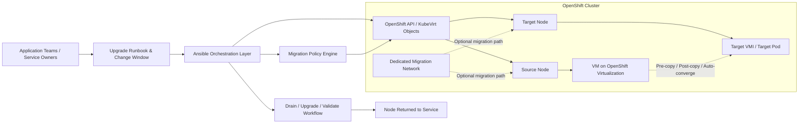
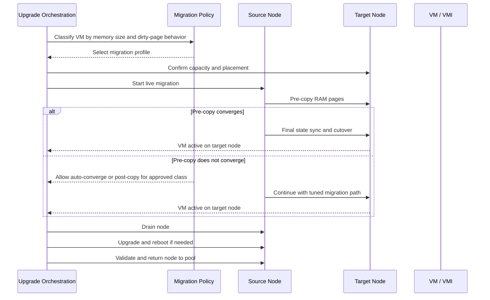
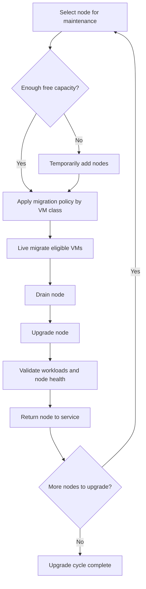

# Solution Draft: OpenShift Virtualization Migration Strategy

## Purpose
This draft outlines a simple target architecture for reducing upgrade-related downtime in OpenShift environments that run virtual machines on OpenShift Virtualization. The design assumes that the primary mechanism is in-cluster live migration between nodes, and that the main engineering problem is improving migration convergence for large-memory or high-dirty-rate VMs.[page:1][page:2]

## Architectural concept
The proposed architecture keeps OpenShift Virtualization and KubeVirt as the native execution and migration layer, then adds an orchestration and policy layer around them. That outer layer applies workload-aware migration policies, stages migrations ahead of node drains, and routes heavy migrations over a dedicated migration network where available.[page:2][web:2][web:7]

The design does not assume shared live memory between nodes. The documented migration model is still transfer of VM state from a source node to a destination node, with tuning used to improve success and reduce interruption during the cutover phase.[page:2]

## Logical architecture

This model places Ansible and operational automation above native OpenShift Virtualization constructs rather than beside them as a separate hypervisor stack. The result is a design where policy, sequencing, and observability can be customized without replacing the underlying KubeVirt and QEMU migration engine.[web:2][page:2]

## Migration flow

The main control point is policy selection before migration begins. That lets the workflow apply different behaviors to standard workloads versus large-memory or high-churn workloads instead of forcing one migration profile across the whole fleet.[page:2][web:7]

## Policy layers
| VM class | Recommended approach | Rationale |
|---|---|---|
| Standard VM | Pre-copy live migration.[page:2] | Default path is generally the safest and simplest operational model. |
| Large-memory, moderate churn | Pre-copy with tuned bandwidth, completion timeout, progress timeout, and optional dedicated migration network.[page:2][web:7] | Improves convergence without immediately increasing recovery risk. |
| Large-memory, high churn | Pre-copy plus auto-converge, or post-copy only for approved workloads.[page:2][web:8] | Addresses dirty-page pressure when standard pre-copy does not finish reliably. |
| Capacity-constrained upgrade window | Temporary node expansion followed by migration and drain.[page:1][page:2] | Adds headroom for evacuation and maintenance without changing the underlying migration model. |

## Upgrade pattern

This workflow preserves the node expansion idea as a supporting tactic. Extra nodes improve migration headroom and make draining easier, but they do not change the fact that memory is migrated by transferring VM state between nodes rather than by sharing a single in-memory instance.[page:1][page:2]

## Key components
- **OpenShift Virtualization / KubeVirt** provides the native VM runtime and live migration framework used to move running VMs between nodes in a cluster.[page:1][page:2]
- **QEMU/KVM under the stack** remains the execution engine underneath KubeVirt, which means migration behavior is still fundamentally tied to VM state transfer, memory churn, and cutover mechanics.[page:2]
- **Ansible orchestration** acts as the control layer for classification, sequencing, change execution, rollback gates, and repeatable upgrade workflows.[web:2]
- **Migration policy controls** include bandwidth settings, completion timeout, progress timeout, auto-converge, post-copy, and parallel migration limits.[page:2][web:7]
- **Dedicated migration network** is an optional but valuable path for improving determinism and throughput during live migration.[page:2]
- **Temporary node expansion** provides a fallback capacity pattern for upgrades where live migration headroom is otherwise too tight.[page:1][page:2]

## Practical interpretation
The simplest version of the solution is not a new middleware product. It is a policy-driven operating model layered on top of native OpenShift Virtualization live migration, supported by automation, workload classification, and selective use of advanced migration features for difficult VM profiles.[page:2][web:2]

That makes this a realistic enterprise proposal path: keep the platform native, tune for large-memory behavior, automate the upgrade sequence, and reserve temporary node expansion for cases where capacity is the main blocker to successful evacuation and maintenance.[page:1][page:2][web:7]
